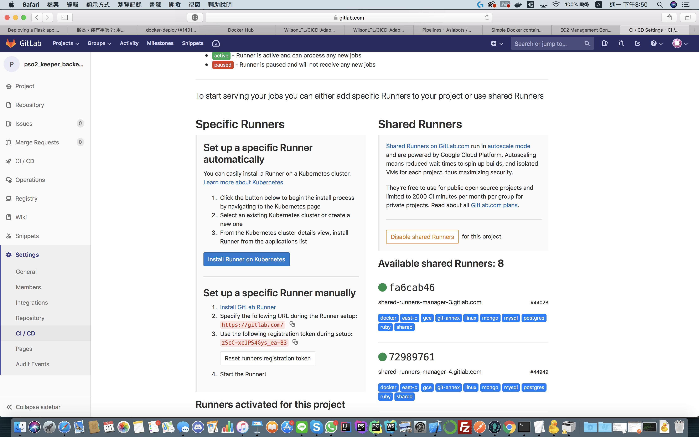

# CICD_runner_adapter

A adapter for virtual environment, to request api for update docker image, you should clone the adapter in your deploy location (e.g EC2, EBS) <br >
Demo video:https://www.youtube.com/watch?v=BXaibSEF5FU 

## 1. add .gitlab-ci.yml in the project
1. .gitlab-ci.yml is a file for gitlab to kick start the CICD function, add to your project before doing the following step. 
2. set up your .gitlab-ci.yml file in 3 stages : build for environment testing, test for unit testing, deploy for deployment testing. <br >
Build for build testing, such as install the requirement in differ vision <br >
Test for unit testing, such as run the server in code level, and test to build the docker image <br >
Deploy for deployment testing, deploy the docker image in to docker hub <br >

e.g NodeJS example
```
stages:
  - build
  - test
  - deploy

buildtest-node:
  image: node:latest
  stage: build
  script:
    - apt-get update -qy
    - npm install

unittest-node:
  image: node:latest

  stage: test
  script:
    - apt-get update -qy
    - npm install

docker-test:
  image: docker:latest
  services:
    - docker:dind
  stage: test
  script:
  - docker login -u wilsonloltl -p Vi26151851@
  - docker build -t wilsonloltl/nlpwordcloud:nlpwordcloud .
  - docker run -d -p 5000:5000 wilsonloltl/nlpwordcloud:nlpwordcloud

docker-deploy:
  image: docker:latest
  services:
      - docker:dind
  stage: deploy
  script:
      - docker login -u wilsonloltl -p Vi26151851@
      - docker build -t wilsonloltl/nlpwordcloud:nlpwordcloud .
      - docker push wilsonloltl/nlpwordcloud:nlpwordcloud
  only:
      - master
```

e.g Python example
```
stages:
  - build
  - test
  - deploy

buildtest-python:
  stage: build
  script:
    - apt-get update -qy
    - apt-get install -y python-dev python-pip
    - pip install -r requirements.txt
  tags:
    - python2.7

unittest-py27:
  stage: test
  script:
    - apt-get update -qy
    - apt-get install -y python-dev python-pip
    - pip install -r requirements.txt
  tags:
    - python2.7

unittest-py34:
  stage: test
  script:
    - apt-get update -qy
    - apt-get install -y python-dev python-pip
    - pip install -r requirements.txt
  tags:
    - python3/4

docker-test:
  image: docker:latest
  services:
    - docker:dind
  stage: test
  script:
    - docker login -u wilsonloltl -p Vi26151851@
    - docker build -t wilsonloltl/docker_cicd_testing:cicd-demo .
  only:
    - master

docker-deploy:
  image: docker:latest
  services:
    - docker:dind
  stage: deploy
  script:
    - docker login -u wilsonloltl -p Vi26151851@
    - docker build -t wilsonloltl/docker_cicd_testing:cicd-demo .
    - docker push wilsonloltl/docker_cicd_testing:cicd-demo
  only:
    - master
```

*PS: You should regisiter a docker hub account and create a new repo for the project, also modify the following code in deploy stage to deploy
```
docker-deploy:
  image: docker:latest
  services:
    - docker:dind
  stage: deploy
  script:
    - docker login -u USERNAME -p PASSWORD
    - docker build -t USERNAME/REPO_NAME:TAG_NAME .
    - docker push USERNAME/REPO_NAME:TAG_NAME
  only:
    - master
```
3. add and push your .gitlab-ci.yml, you can check the format in gitlab, which locate in CI/CD -> Pipeline -> CI Lint

4. If the file follow format,git CI will start running, you can take a look in CI/CD Pipeline, for more detail,just click it :D


## 2. Set up the adapter in your locate environment
For sure, enter to your EC2 or EBS by ssh, clone and cd the adapter

1. Install the following requirements
```
apt-get update -qy
apt install python-pip
apt install docker.io
pip install -r requirements.txt
```
2. Modify update.sh file 
```
line2: Your docker hub account and password
line3: Pull the docker image -> USERNAME/REPO_NAME:TAG_NAME
line4: The port connect to docker exposed port -> LOCATEPORT:DOCKERPORT
```
3. Auto setting
```
cd ~/usr/sbin
sudo touch api.sh
sudo chown root:root api.sh
sudo chmod +x api.sh
sudo nano api.sh
code in api.sh:
    cd /home/USERNAME/CICD_Adapter
    python3 Main.py
crontab -e
add in the last line: @reboot /usr/sbin/api.sh
For EBS: press ESC, :wq to leave
For ec2: press control+x , y to leave
sudo reboot
```
The adapter should be auto kick start after reboot in port 8080

### Detail for update.sh
```
#!/usr/bin/env bash
sudo docker login -u wilsonloltl -p Vi26151851@    ---- Login the account
sudo docker pull wilsonloltl/docker_cicd_testing:cicd-demo    --- Pull the latest image
sudo docker stop $(sudo docker ps -aq)   --- Stop all the container 
sudo docker rm $(sudo docker ps -aq)   --- Remove all the container
sudo docker run -d -p 5000:5000 wilsonloltl/docker_cicd_testing:cicd-demo   --- Start the container again with the lastest image vision
```

### CD part
There are two type of CD : Manual CD and Auto CD :<br >
1. Manual CD, after the Pipeline is finish, then you can send a request to the adapter server in HOSTADDRESS:PORT/update_docker, POST or GET is ok too,
the system will auto pull the latest vision of docker hub and restart the container.
3. Auto CD, you can modify the code in .gitlab-ci.yml - deploy part, to curl a request to adapter after push the image into docker hub.


## Option: setup your own gitlab runner
Gitlab Runner is a part for your CI Pipeline, and can assign the Runner to doing differ jobs of Pipeline by "Tags",also,you can deploy your own Runner too.
### 1. set up in EC2 or EBS
```
apt-get update -qy
apt install python-pip
apt install docker.io
sudo docker pull gitlab/gitlab-runner
sudo docker run -d \
--name gitlab-runner-docker \
--restart always \
-v /run/docker.sock:/var/run/docker.sock \
-v /host/path/for/runner:/etc/gitlab-runner \
gitlab/gitlab-runner:latest
sudo docker exec -it gitlab-runner-docker gitlab-runner register
```
### 2. Register your runner
To register your runner, you need to visit your gitlab project by setting -> CI/CD -> Runners

```
Please enter the gitlab-ci coordinator URL:
 - If the project not host in locate gitlab, it should be always https://gitlab.com
Please enter the gitlab-ci token for this runner:
 - Your project CI token, just copy it
Please enter the gitlab-ci description for this runner
 - Write somethings you like 
Please enter the gitlab-ci tags for this runner (comma separated):
 - Improtant: the tags name og Runner will affect you to assign the job to it in .gitlab-ci.yml, give it a "good" tag name
 
```